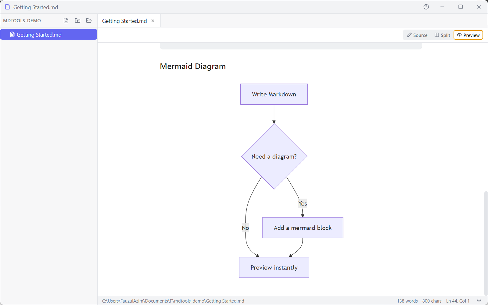
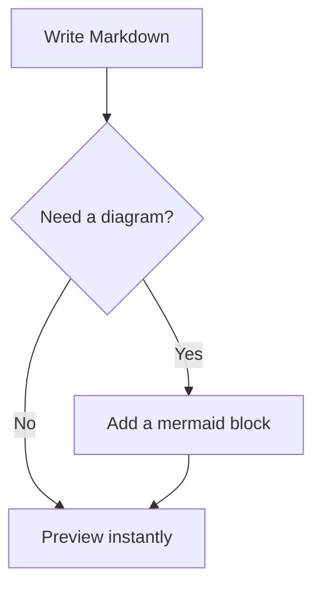
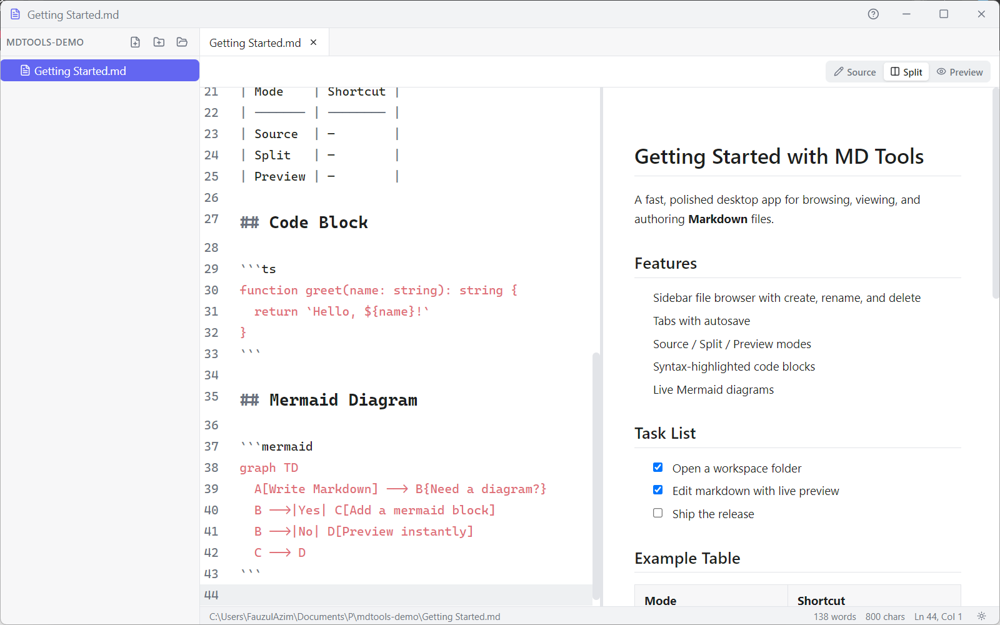

# MD Tools

A fast, polished desktop app for browsing, viewing, and authoring Markdown files — with live preview, built-in Mermaid diagram rendering, and automatic update checks in packaged builds.

Current app version: **v1.9.0**.

This is the **source repository** (private). For the latest prebuilt Windows installer or portable build, see
[LRecodex/mdtools-releases](https://github.com/LRecodex/mdtools-releases/releases/latest).



## Tech stack

- **Shell:** Electron, built/bundled with `electron-vite`
- **UI:** React + TypeScript, Tailwind CSS, `lucide-react` icons, Zustand for state
- **Editor:** CodeMirror 6 (`@codemirror/lang-markdown`)
- **Rendering:** `markdown-it` (+ `markdown-it-task-lists`) for Markdown, `highlight.js` for code, `mermaid` for diagrams
- **Filesystem:** Node `fs` in the main process, live-reloaded via `chokidar`

## Development

```bash
npm install
npm run dev        # start the app in development mode (electron-vite dev)
npm run typecheck  # type-check main, preload, and renderer
npm run build      # production build (out/)
npm run dist       # package Windows installer + portable build (release/)
npm run dist:dir    # unpacked build only, skips installer packaging — fast iteration
npm run icon       # regenerate app icons from source art (scripts/generate-icon.mjs)
```

`npm run dist` packages via `electron-builder` (see `electron-builder.yml`): an NSIS installer and
a portable `.exe`, both Windows x64. Output lands in `release/`.

## Project structure

```
src/
  main/            Electron main process — window creation, settings persistence,
                    file-system + dialog IPC handlers, chokidar-based file watcher
  preload/         contextBridge API surface exposed to the renderer (window.api)
  renderer/src/
    components/    Sidebar, Editor (Source/Split/Preview + Mode switcher), TitleBar,
                    StatusBar, QuickOpen, Dialogs, common/ (shared primitives)
    store/         Zustand store — workspace tree, open tabs, editor mode, theme
    lib/           markdown-it setup, CodeMirror theme, path helpers
  shared/          Types shared between main and renderer
```

## Features

| | |
| --- | --- |
| **Workspace browsing** | Open a folder and create, rename, and delete files/folders right from the sidebar; new items follow the selected folder |
| **Tabs** | Work on several files at once; right-click tabs to close current/others/right/all, copy paths, or reveal files |
| **Source / Split / Preview** | Switch between raw markdown, a live side-by-side split, or a full rendered preview |
| **Formatting toolbar** | Insert or wrap headings, bold/italic text, links, lists, tasks, tables, code, and Mermaid templates |
| **Document templates** | Start quickly with 15 templates for meetings, projects, study, development, journals, checklists, and more |
| **Resizable sidebar** | Drag the workspace navigation edge for long file names; double-click the edge to reset |
| **Autosave** | Changes save automatically shortly after you stop typing, or instantly with `Ctrl+S` |
| **Quick Open** | `Ctrl+P` searches file and folder names, paths, and text inside Markdown, text, JSON, code, and CSV files; content matches include a short excerpt |
| **Support LRecodex** | Open the sidebar donation section to scan the included Maybank QR code |
| **Find in document** | `Ctrl+F` searches Source, Split, or Preview; Source also supports replace, whole words, and regular expressions |
| **Command palette** | `Ctrl+Shift+P` opens workspace, search, settings, updates, help, and theme commands |
| **Welcome dashboard** | Start from recent workspaces, settings, or a new folder when no workspace is open |
| **Outline + backlinks** | Markdown files show headings, wiki links, and backlinks in a side panel on wide screens |
| **Wiki links** | Use `[[Page Name]]` to open or create related Markdown pages |
| **HTML export** | Export rendered Markdown previews as PDF or standalone HTML |
| **Settings dialog** | Adjust theme, default editor mode, sidebar visibility, sidebar width, and update status |
| **User-controlled updates** | Packaged builds show update availability in the status bar, let you download when ready, then restart to install |
| **Themes** | Light / dark / system, cycled with `Ctrl+,` |
| **Built-in Help** | `Ctrl+/` opens an in-app cheat sheet for syntax, shortcuts, and Mermaid |

## Markdown & Mermaid support

Standard Markdown renders via `markdown-it`: headings, bold/italic, links, blockquotes, task lists
(`- [ ]` / `- [x]`), tables, and fenced code blocks — with syntax highlighting for **JS/TS, Python,
Bash, JSON, HTML, CSS, YAML, C++, Java, and SQL** (registered languages live in
`src/renderer/src/lib/markdown.ts`). Common inline HTML is supported and sanitized before display;
scripts, event handlers, embedded pages, forms, and inline styles are removed.

Fence a code block with `mermaid` and it renders live in Preview/Split mode — flowcharts, sequence
diagrams, Gantt charts, state diagrams, and more:

````markdown

```mermaid
graph TD
  A[Write Markdown] --> B{Need a diagram?}
  B -->|Yes| C[Add a mermaid block]
  B -->|No| D[Preview instantly]
  C --> D
```
````



### Keyboard shortcuts

| Shortcut | Action |
| --- | --- |
| `Ctrl+N` | New document from a template |
| `Ctrl+O` | Open folder |
| `Ctrl+S` | Save current file |
| `Ctrl+W` | Close current tab |
| `Ctrl+Shift+W` | Close all tabs |
| `Ctrl+P` | Quick Open |
| `Ctrl+Shift+P` | Command Palette |
| `Ctrl+F` | Find in current document |
| `F3` / `Shift+F3` | Next / previous match |
| `Ctrl+H` | Find and replace (Source / Split) |
| `Ctrl+Tab` / `Ctrl+Shift+Tab` | Next / previous tab |
| `Ctrl+PageUp` / `Ctrl+PageDown` | Previous / next tab |
| `Ctrl+Shift+B` | Show / hide sidebar |
| `Ctrl+Shift+T` | Apply a template to the current document (with replacement confirmation) |
| `Ctrl+,` | Cycle theme (system → light → dark) |
| `Ctrl+/` | Toggle in-app help |

Shortcut handling lives in `src/renderer/src/hooks/useKeyboardShortcuts.ts`; the same feature list
and examples are shown in-app via `Ctrl+/` (`HelpDialog.tsx`).

## Releases

Tagged builds are published as installers to
[LRecodex/mdtools-releases](https://github.com/LRecodex/mdtools-releases/releases/latest)
(Setup + Portable, Windows x64, unsigned).

Packaged builds use `electron-updater` with the GitHub Releases feed configured in
`electron-builder.yml`. The app checks for updates shortly after startup. When a newer release is
available, a status bar action appears so the user can download it when ready. After the download
finishes, the action changes to **Restart to update** and installs with `quitAndInstall()`.
